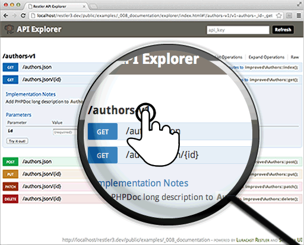

Documentation <requires>PHP >= 5.3</requires>
-------------
<tag>create</tag> <tag>retrieve</tag> <tag>read</tag> <tag>update</tag> <tag>delete</tag> <tag>post</tag> <tag>get</tag> <tag>put</tag> <tag>routing</tag> <tag>doc</tag> <tag>production</tag> <tag>debug</tag> 

How to document and let your users explore your API.
We have modified SwaggerUI to create 
[Restler API Explorer](https://github.com/Luracast/Restler-API-Explorer)
which is used [here](explorer/index.html#!/authors-v1).

We are progressively improving the Authors class from CRUD example 
to Rate Limiting Example to show Best Practices and Restler 3 Features.

Make sure you compare them to understand.

Even though API Explorer is created with API consumers in mind, it will help the
API developer with routing information and commenting assistance when  our API
class is not fully commented as in this example. This works only on the debug
mode. Try changing rester to run in production mode (`$r = new Restler(true)`)

> **Note:-** production mode writes human readable cache file for the routes in
> the cache directory by default. So make sure cache folder has necessary
> write permission.

Happy Exploring! :)

> This API Server is made using the following php files/folders
> 
> * index.php      (gateway)
> * Authors.php      (api)
> * Resources.php      (api)
> * restler.php      (framework)
> * JsonFormat.php      (format)

This API Server exposes the following URIs

    GET    authors                   ⇠ improved\Authors::index()
    GET    authors/{id}              ⇠ improved\Authors::get()
    GET    resources/{id}-v{version} ⇠ Resources::get()
    GET    resources/v{version}      ⇠ Resources::get()
    GET    resources                 ⇠ Resources::index()
    POST   authors                   ⇠ improved\Authors::post()
    PUT    authors/{id}              ⇠ improved\Authors::put()
    PATCH  authors/{id}              ⇠ improved\Authors::patch()
    DELETE authors/{id}              ⇠ improved\Authors::delete()

*[index.php]: _008_documentation/index.php
*[Authors.php]: _008_documentation/improved/Authors.php
*[Resources.php]: ../../vendor/Luracast/Restler/Resources.php
*[restler.php]: ../../vendor/restler.php
*[JsonFormat.php]: ../../vendor/Luracast/Restler/Format/JsonFormat.php

