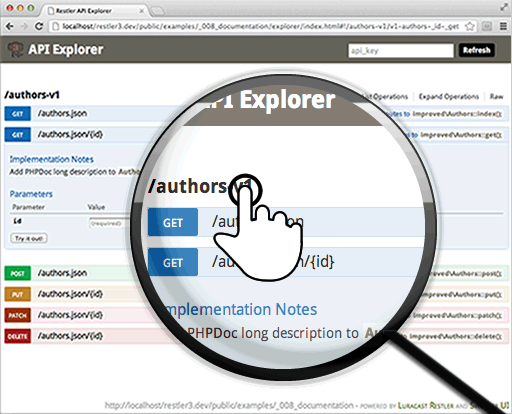

## Rate Limiting 

 This example requires `PHP >= 5.4` and tagged under `create` `retrieve` `read` `update` `delete` `post` `get` `put` `filter` `throttle` `rate-limiting`


How to Rate Limit API access using a Filter class that implements
`iFilter` interface.

This example also shows how to use Defaults class to customize defaults, how to create your own
iCache implementation, and how to make a hybrid filter class that behaves differently
when the user is Authenticated

[](explorer/index.html#!/authors-v1)

Key in `r3rocks` as the API key in the Explorer to see how rate limit changes

We are progressively improving the Authors class from CRUD example
to show Best Practices and Restler 5 Features.

Make sure you compare them to understand.

> **Note:-**
>
>  1. Using session variables as DB and Cache is useless for real life and wrong. We are using it
>     Only for demo purpose. Since API Explorer is browser based it works well with that.
>
>  2. We are using Author.php to document return type of `GET authors/{id}` using `@return` comment

If you have hit the API Rate Limit or screwed up the Authors DB, you can easily reset by deleting
PHP_SESSION cookie using the Developer Tools in your browser.

> This API Server is made using the following php files/folders
> 
> * index.php      (gateway)
> * RateLimit.php      (filter)
> * Authors.php      (api)
> * Author.php      (helper)
> * KeyAuth.php      (auth)
> * restler.php      (framework)
> * JsonFormat.php      (format)

This API Server exposes the following URIs

    GET    authors          ⇠ ratelimited\Authors::index()
    POST   authors          ⇠ ratelimited\Authors::post()
    PATCH  authors/reset    ⇠ ratelimited\Authors::patchReset()
    GET    authors/{id}     ⇠ ratelimited\Authors::get()
    PUT    authors/{id}     ⇠ ratelimited\Authors::put()
    PATCH  authors/{id}     ⇠ ratelimited\Authors::patch()
    DELETE authors/{id}     ⇠ ratelimited\Authors::delete()
    GET    explorer/*       ⇠ Luracast\Restler\Explorer\v2\Explorer::get()
    GET    explorer/swagger ⇠ Luracast\Restler\Explorer\v2\Explorer::swagger()


We expect the following behaviour from this example.

```gherkin

@example9 @rate-limit
Feature: Testing Rate Limiting Example

  Scenario: Resetting data to begin tests
    When I request "PATCH examples/_009_rate_limiting/authors/reset.json"
    Then the response status code should be 200
    And the response should be JSON
    And the response equals true

  Scenario: Creating new Author by POSTing vars
    Given that I want to make a new "Author"
    And his "name" is "Chris"
    And his "email" is "chris@world.com"
    When I request "examples/_009_rate_limiting/authors"
    Then the response status code should be 201
    And the response should be JSON
    And the response has a "id" property

  Scenario: Creating new Author with JSON
    Given that I want to make a new "Author"
    And his "name" is "Chris"
    And his "email" is "chris@world.com"
    And the request is sent as JSON
    When I request "examples/_009_rate_limiting/authors"
    Then the response status code should be 201
    And the response should be JSON
    And the response has a "id" property

  Scenario: Updating Author with JSON without Authentication
    Given that I want to update "Author"
    And his "name" is "Jac"
    And his "email" is "jac@wright.com"
    And his "id" is 1
    And the request is sent as JSON
    When I request "examples/_009_rate_limiting/authors/{id}"
    Then the response status code should be 401
    And the response "WWW-Authenticate" header should be 'Query name="api_key"'
    And the response should be JSON
    And the "error.message" property equals "Unauthorized"

  Scenario: Updating Author with JSON with Authentication
    Given that I want to update "Author"
    And his "name" is "Jac"
    And his "email" is "jac@wright.com"
    And his "id" is 1
    And the request is sent as JSON
    When I request "examples/_009_rate_limiting/authors/{id}?api_key=r3rocks"
    Then the response status code should be 200
    And the response should be JSON
    And the "name" property equals "Jac"

  Scenario: Given url is valid for other http method(s)
    Given that I want to update "Author"
    And his "name" is "Jac"
    And his "email" is "jac@wright.com"
    And his "id" is 1
    And the request is sent as JSON
    When I request "examples/_009_rate_limiting/authors"
    Then the response status code should be 405
    And the response "Allow" header should be "GET, POST"

  Scenario: Deleting Author
    Given that I want to delete an "Author"
    And his "id" is 1
    When I request "examples/_009_rate_limiting/authors/{id}?api_key=r3rocks"
    Then the response status code should be 200
    And the response should be JSON
    And the response has an "id" property

  Scenario: Deleting with invalid author id
    Given that I want to delete an "Author"
    And his "id" is 1
    When I request "examples/_009_rate_limiting/authors/{id}?api_key=r3rocks"
    Then the response status code should be 404
    And the response should be JSON

```

It can be tested by running the following command on terminal/command line
from the project root (where the vendor folder resides). Make sure `base_url`
in `behat.yml` is updated according to your web server.

```bash
vendor/bin/behat  features/examples/_009_rate_limiting.feature
```


*[index.php]: _009_rate_limiting/index.php
*[RateLimit.php]: ../../src/Filter/RateLimit.php
*[Authors.php]: _009_rate_limiting/ratelimited/Authors.php
*[Author.php]: ../../public/examples/_009_rate_limiting/Author.php
*[KeyAuth.php]: _009_rate_limiting/KeyAuth.php
*[restler.php]: ../../restler.php
*[JsonFormat.php]: ../../src/Format/JsonFormat.php

*[Author.php]: _009_rate_limiting/Author.php