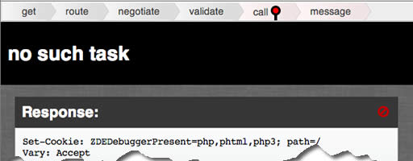
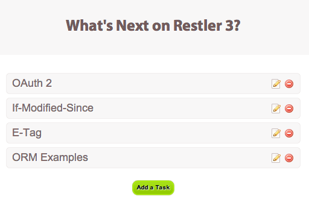

## Html Format 

 This example requires `PHP >= 5.4` and tagged under `view` `html` `twig` `mustache` `handlebar` `php` `template`


A special format that lets us render a template with the api result

It currently supports the following template libraries/formats

 - php (default)
 - mustache / handlebar (requires `"mustache/mustache"`)
 - twig (requires `"twig/twig"`)
 - Laravel 4 blade templates (requires `"illuminate/view"`)

When HtmlFormat is used with out defining a view it uses debug view to present
data and more information

[](tasks/24)

View can be defined directly by setting `HtmlFormat::$view` and
`HtmlFormat::$format` where view defines the template file and format determines
the template type. When the view is defined with an extension such as `my.twig`
the extension will override the format

`HtmlFormat::$errorView` which defaults to the debug view defines the view when
the api call fails. When set to null `HtmlFormat::$view` is used for rendering
error response as well

`HtmlFormat::$view` can be set with a api method comment in the following format

    @view  folder/name.extension

When the extension is omitted `HtmlFormat::$format` will be used

HtmlFormat will look at `views` folder that resides parallel to `vendor` directory
for the template files and can be changed by setting `HtmlFormat::$viewPath` to
full path of a folder

> This API Server is made using the following php files/folders
> 
> * index.php      (gateway)
> * Tasks.php      (api)
> * Task.php      (helper)
> * Resources.php      (api)
> * restler.php      (framework)
> * JsonFormat.php      (format)
> * HtmlFormat.php      (format)

This API Server exposes the following URIs

    GET    resources              ⇠ Luracast\Restler\Resources::index()
    GET    resources/verifyaccess ⇠ Luracast\Restler\Resources::verifyAccess()
    GET    resources/{id}         ⇠ Luracast\Restler\Resources::get()
    GET    tasks                  ⇠ Tasks::index()
    POST   tasks                  ⇠ Tasks::post()
    PATCH  tasks/reset            ⇠ Tasks::patchReset()
    GET    tasks/{id}             ⇠ Tasks::get()
    PATCH  tasks/{id}             ⇠ Tasks::patch()
    DELETE tasks/{id}             ⇠ Tasks::delete()


In this example, we are building tasks api and also a single page application
using jQuery and the templates

[](tasks)

Our api response is sent to the template under the name `response` along with other
information such as `basePath`, `baseUrl`, `request` parameters.

You can send custom data yourself by setting key value pairs in
`HtmlFormat::$data` array

If you do not want all the information and want to keep your template simple, you
can use `{@data key.innerkey}` comment as shown below

    @view todo/list {@data response}

This calls the list template with key value pairs defined at the response array
directly accessible as the variable and value inside the template

This example also show cases the heredoc syntax based simple templating system
which is Supported without any external dependencies

Just to show that it is possible to come up with API as well as an App using the
same resource and url, you can try the json version of the tasks api using the
API Explorer [here](explorer/index.html)


We expect the following behaviour from this example.

```gherkin

@example13 @html
Feature: Testing Html

  Scenario: Resetting data to begin tests
    When I request "PATCH examples/_013_html/tasks/reset"
    Then the response status code should be 200
    And the response is JSON
    And the value equals true

  Scenario: Getting Html response
    When I request "examples/_013_html/tasks.html"
    Then the response status code should be 200
    And the response is HTML

  Scenario: Getting Json response
    When I request "examples/_013_html/tasks.json"
    Then the response status code should be 200
    And the response is JSON

  Scenario: Getting Html response for a tag
    When I request "examples/_013_html/tasks/1.html"
    Then the response status code should be 200
    And the response is HTML

  Scenario: Getting Json response for a tag
    When I request "examples/_013_html/tasks/2.json"
    Then the response status code should be 200
    And the response is JSON

  Scenario: Deleting a task
    Given that I want to delete a "Task"
    And its "id" is 1
    When I request "examples/_013_html/tasks/{id}.json"
    Then the response status code should be 200
    And the response should be JSON
    And the response has an "id" property

  Scenario: Getting Html response for a missing tag
    When I request "examples/_013_html/tasks/1.html"
    Then the response status code should be 404
    And the response is HTML

  Scenario: Getting Json response for a deleted tag
    When I request "examples/_013_html/tasks/1.json"
    Then the response status code should be 404
    And the response is JSON
    And the response has a "error" property


```

It can be tested by running the following command on terminal/command line
from the project root (where the vendor folder resides). Make sure `base_url`
in `behat.yml` is updated according to your web server.

```bash
bin/behat  features/examples/_013_html.feature
```


*[index.php]: _013_html/index.php
*[Tasks.php]: _013_html/Tasks.php
*[Task.php]: _013_html/DB/Task.php
*[Resources.php]: ../../vendor/Luracast/Restler/Resources.php
*[restler.php]: ../../vendor/restler.php
*[JsonFormat.php]: ../../vendor/Luracast/Restler/Format/JsonFormat.php
*[HtmlFormat.php]: ../../vendor/Luracast/Restler/Format/HtmlFormat.php

