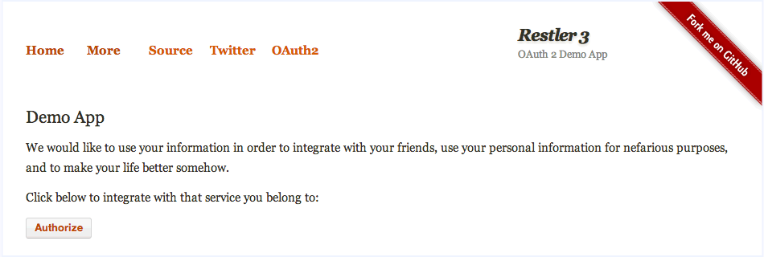
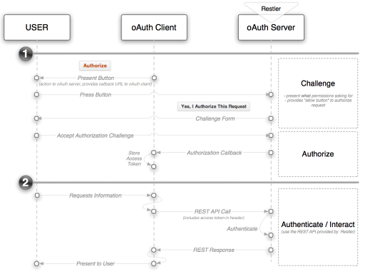

## OAuth2 Client 

 This example requires `PHP >= 5.3.9` and taggeed under `access-control` `acl` `secure` `authentication` `authorization`

### Setting up the client example

In order to run this example on your localhost do the following

1. run composer update to make sure you have
    - twig template library
    - bshaffer's oauth2 library
2. make sure `public/examples/_014_oauth2_client/cache` has write permissions to create the compiled template files

Now that you are ready, lets look at the example

> This API Server is made using the following php files/folders
> 
> * index.php      (gateway)
> * Client.php      (api)
> * restler.php      (framework)
> * JsonFormat.php      (format)

This API Server exposes the following URIs

    GET            ⇠ Auth\Client::index()
    GET authorized ⇠ Auth\Client::authorized()

This example is part 1 in a 2 part example that shows how Restler can
be integrated with the popular [OAuth 2.0 Server ](http://bshaffer.github.io/oauth2-server-php-docs/)
library. This section -- the "client" -- is about asking for access rights and keeping a record of the
important state mechanisms required to communicate with Restler once access has been granted. 

If you're not familiar with OAuth, it's worth familiarizing yourself with the 
basics and in particular understanding the various workflow that OAuth 2.0 offers.
The following two links may help:

- [Official OAuth Specification](http://tools.ietf.org/html/draft-ietf-oauth-v2): 
  a bit dry but if you want the "facts" they're there.
- [OAuth2 Simplified](http://aaronparecki.com/articles/2012/07/29/1/oauth2-simplified): 
  a nicely summarized overview of how to think through the key aspects of OAuth 2.0

The role of the `client application` in OAuth is two-fold:

1. Asking for access (aka, Authorization)
2. Making authenticated requests (aka, Authentication)

It's important to understand that the *workflow* of asking for access varies by "grant type" in OAuth.
The standard grant-types that OAuth 2.0 Server  supports out-of-the-box are:

- **Implicit**: typically for browser based or mobile apps
- **Authorization Code**: typically for apps running on a server
- **Password Credentials**: typically used for apps that are owned by the same organisation as the OAuth service provider (aka, the Twitter client, etc.)
- **Client Credentials**: used by client's who want to update meta information about their site (URL's, logo's, etc.)
- **JWT Auth Grant**: the client submits a *JSON Web Token* in a request to the token endpoint. An access token (without a refresh token) is then returned directly.
- **Refresh Token**: client can submit refresh token and receive a new access token

## Workflow ##
In this example the `OAuth server` is setup to manage the `authorization code` grant. Holistically
there really two parts to the process. First, the client must get authorization from the server and then
it will use that authorization (in the form of an "access token") to authenticate with the REST API from 
that point forward. The two flows are illustrated below:

###Authorization###
The client apps role in authentication is two-fold. First it must direct the user to the server to start 
the process. And second, when the authorization has completed the client application's *callback* function will be executed
and it will be responsible for saving the authorization information. 

###Authentication###
Once the proper authorization has been attained by the client app, it's sole responsibility is to pass along it's 
authorization status in each RESTful API request. This is achieved by the client application adding a *query parameter* of 
'code' set to the access token that the OAuth Server provided to the application in the authorization step. 

> **Note:-**
> there is an optional parameter on the server that allows the Access Token to be passed as a header variable instead of a
> query parameter.

## In Conclusion ##
The "client application" plays an important role in the OAuth interaction and while your Restler server's primarily role will
likely be to play the *server* role in this process it is useful to know that both client and server are available as part of
the [OAuth 2.0 Server ](http://bshaffer.github.io/oauth2-server-php-docs/) module and both are easily made available to Restler. 

For more information on how to start using this functionality with Restler be sure to look at the [OAuth Server example](../_015_oauth2_server/index.php).

*[index.php]: _014_oauth2_client/index.php
*[Client.php]: _014_oauth2_client/Auth/Client.php
*[restler.php]: ../../vendor/restler.php
*[JsonFormat.php]: ../../vendor/Luracast/Restler/Format/JsonFormat.php

