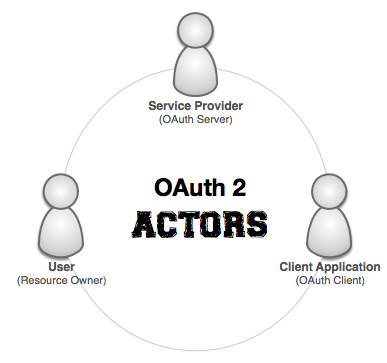

#The Actors Involved#
[<< Back to OAuth](oauth.md) | [Forward to **Grant Types** >>](grant-types.md)

There is enough happening in OAuth that it's worth taking the time to define both the **Actors** who are involved in these processes/workflows as well as describe with a macro lens the functional **workflows** that OAuth is solving for.

The actors involved in OAuth include the following:

1. **User / Resource Owner** - this is the person who is the rightful owner of the data. 
2. **Client Application** - an application that would like to *get* information from the *resource owner* on behalf of the *user*.
3. **Service Provider** - this is application that hosts the data for the *user* and in this case this would be the Restler/OAuth server that would take on this responsibility.

These three actors engage in various detailed workflows which will be discussed in greater length in the *grant-types* section but at a high level the requirements are intended to fulfill the following functional workflows:

1. **Client Registration** - this is the first step in the OAuth process and it involves establishing a relationship between the Client Application and the Service Provider. In this interaction the Client provides details such as a `callback_uri`, `default_scope`, `grant_type(s)`, and other details that the Service Provider requires. In return, the Service Provider provides a `client_id` which uniquely identifies the Client and with some grant-types it also provides a `client_secret` which is used to further secure the communication. This step in the process will require some custom coding to implement this workflow as it is not explicitly covered in OAuth (but rather assumed).
2. **Authorization** - this is the core process that OAuth provides. There are several *grant-types* which influence the detailed flow of how the three actors engage to Authorize the Client but the culmination of this process always results in an `access_token` being provided to the Client so that this can be used in the *authentication* workflow. All of the major grant-types are covered by the OAuth server so this functionality should be largely out-of-the-box outside of a little setup code.
3. **Authentication** - once authorization has completed, subsequent Client interactions with your OAuth server will require that the `access_token` be presented as an Authentication tool. This authentication process leverages Restler's Protected API functionality (including implementing the iAuthenticate interface) combined with the OAuth2.0 server's functionality. This functionality, requires a little setup but should largely be out-of-the-box.