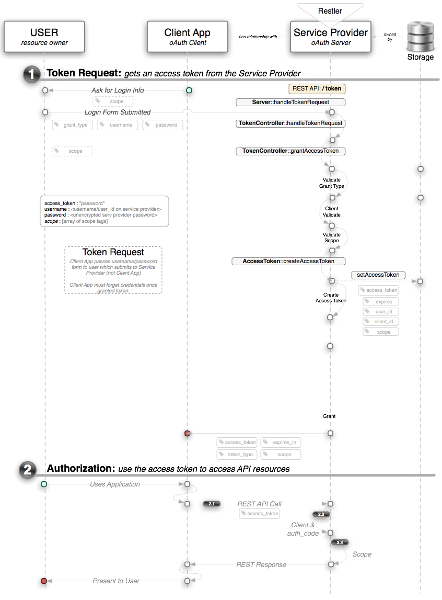

#Grant Types#
[<< Back to OAuth](oauth.md) | [Forward to **Client Registration >>**](actors-involved.md)


###Built-in Grant-Types###
The standard grant-types that OAuth 2.0 Server  supports out-of-the-box are:

- **Authorization Code**: typically for apps running on a server and in all cases an application using this grant-type must be able to "keep a secret" which browser or phone based application can not. Because this grant-type can trust the application to *keep a secret*, this is leveraged to create a more secure solution than the other flows. This is still the most common form of OAuth but flows like the Implicit flow are quickly gathering numbers too.
- **Implicit**: typically for browser based or mobile apps. This is the somewhat watered down version of the Authorization Code grant-type for applications that **can't** keep a secret.
- **User Credentials**: typically used for apps that are owned by the same organization as the OAuth service provider (aka, the Twitter client, etc.). Note that this type is sometimes called `Password Credentials` or `Resource Owner Password`. In all cases the `grant-type` POST variable should be set to `password` for this flow.
- **Client Credentials**: used by client's who want to update meta information about their site (URL's, logo's, etc.)
- **JWT Auth Grant**: the client submits a *JSON Web Token* in a request to the token endpoint. An access token (without a refresh token) is then returned directly.
- **Refresh Token**: client can submit refresh token and receive a new access token

In 99% of cases you'll use the built-in grant types; creating your own grant types is something you can do but it's an advanced topic and will not be covered here. If you feel this is required for your project then reference the *Extension Grants* section in the [OAuth2 Server's documentation](http://bshaffer.github.io/oauth2-server-php-docs/overview/grant-types/).
 
###Setting Up Grant Types###
Grant types are configured by calls to the `addGrantType` method off of the `OAuth2_Server` class. In Restler, you'll want to just add something like the following to the constructor of whatever class you've defined to be your `APIAuthenicationClass`:

```php
static::$server->addGrantType(
    new OAuth2_GrantType_AuthorizationCode(static::$storage)
);
```

Once you've decided which grant-types you want to support and they are configured as stated above, you'll also need to add calls to various API endpoints to enable the underlying steps in the workflow. For instance, the process of an application getting an `access_token` is expected in official OAuth standards to be offered as the `POST /token` endpoint. POST *is* a requirement but you can choose any sensible name as an endpoint as long as your clients know where to go to get an access token. In order to have the OAuth server service a token request you simply add this into the method that handles your endpoint:

```php
static::$server->handleTokenRequest(
	static::$request,
	static::$response)->send();
die();
```

Furthermore, all workflows will need Authorization support added to Restler's `__isAllowed` method. More on this in the Authorization section.


##Specifics##

### Authorization Code ###

> TBD

### Implicit ###

> TBD

### User Credentials ###

The `user credentials` grant workflow is relatively simple to understand as it looks very much like a normal authentication model. The user simply puts in his username and password into the client application and that is then used to authenticate against the server. Before you fall in love with this simplicity, be aware that if you're the service provider you will likely only allow this form of authentication for your own applications (website login, mobile app, etc.). Avoiding giving 3rd parties responsibility for a user's username and password on your platform was one of the reasons OAuth was developed in the first place! That said, for your own applications it's probably a very sensible and intuitive choice. 

One other thing that's important to know about this flow is that the typical pairing of an `access_token` (short-lived) and a `refresh_token` (longer-lived), doesn't make sense for the user_credentials grant type. That doesn't prevent the server -- by default -- from giving you both but that is probably *not* what you want.



### Client Credentials ###

> TBD
