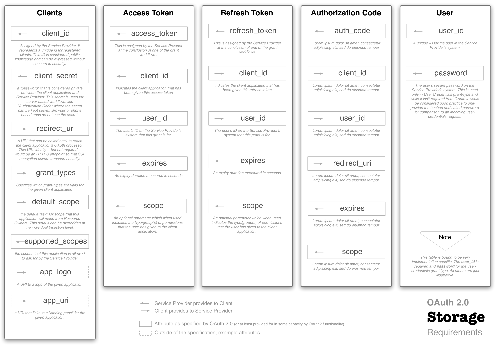

#OAuth Configuration#
[<< Back to OAuth](oauth.md)

This section is still very much a WORK IN PROGRESS.

##OAuth Storage##
The first thing you will need to consider when setting up the server is what database technology you'd like to use to manage state. In the Restler-integrated example you are looking at, the storage is managed in a local SQLite database. The OAuth2 Server package also offers examples for mySQL, Mongo DB, Doctrine, and several other storage technologies. If there isn't an example template available then simply find the one that most closely resembles your technology (e.g., couchbase is similar to mongo, etc.) and spend the time to understand the required interfaces for a storage class. Creating your own storage object -- while not effort free -- is relatively easy so don't use the lack of a pre-existing template as an excuse not move forward.

The diagram below illustrates in a technology-agnostic way the attributes that will be stored to your database once you are operational:

##OAuth Scope##
The term "scope" in OAuth refers to the *amount* of *things* your authorization will allow a client application to do. Some API's simply have a 
single scope for all client applications but even in this case it's important to clearly specify to the user what things the requesting client 
application will be able to do once the "approve button" has been pressed. In more complicated situations *scope* can be broken down into different *roles*. 
This granularity in terms of modifying "the ask" is great way to dramatically increase client's willingness to grant permissions. 

To configure scope you will need to implement the `OAuth2\Storage\ScopeInterface` interface. More documentation can be found here: 
[scope](http://bshaffer.github.io/oauth2-server-php-docs/overview/scope/).

##OAuth Configuration Settings##
There are several default values that the OAuth server will start out with. There values are reasonable but not *firm* in terms of the specification and therefore can be safely changed based on your needs. These options include:

> TBD

##Client Registration Process##

> TBD

##Authentication Process##
