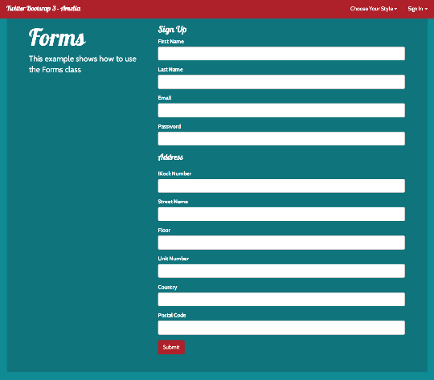

## Forms Example 

 This example requires `PHP >= 5.3` and taggeed under `form` `validation` `blade` `html` `bootstrap` `foundation` `emmet`


Forms is a utility class that builds web forms in one of the following in built styles

  - Plain Html 5
  - Twitter Bootstrap 3
  - Zerb Foundation 5

```php
use Luracast/Restler/UI/Forms;
use Luracast/Restler/UI/FormStyles;

Forms::$style = FormStyles::$bootstrap3; // FormStyles::$foundation5;
```

Where ever you need the generated forms (typically in view templates) just call

```php
echo Forms::get('POST','user/signup');
```

If you are using twig templates you can use the following instead

    {{ form('POST', 'user/signup') }}

## Emmet Templates

Forms is using Emmet templates, with which adding more styles is very easy

Emmet Templates is built with a subset of Emmet as in [emmet.io](http://emmet.io/) extended to serve as a
template engine

For example

    .form-group>label{$label#}+input.form-control[value=$value# type=$type#

Expands to the following html

```html
<div class="form-group">
    <label>Email</label>
    <input class="form-control" value="arul@luracast.com" type="email"/>
</div>
```

When the given data is
```php
array(
    'label' => 'Email',
    'value' => 'arul@luracast.com',
    'type' => 'email'
);
```
Typically this data is supplied by the metadata extracted from the php-doc comments of of the api parameters

Users.php and Address.php shows the bare minimum code needed to get create forms.

Check out the resulting form [here](users.html).
[](users.html)
We have made it easy to try different styles
Also this example serves as an example for our Blade template integration

See bootstrap3.blade.php and foundation5.blade.php

> This API Server is made using the following php files/folders
> 
> * index.php      (gateway)
> * Users.php      (api)
> * Address.php      (helper)
> * restler.php      (framework)
> * HtmlFormat.php      (format)
> * JsonFormat.php      (format)

This API Server exposes the following URIs

    GET  users        ⇠ Users::index()
    POST users/signin ⇠ Users::postSignIn()
    POST users/signup ⇠ Users::postSignUp()


*[bootstrap3.blade.php]: _016_forms/views/base/bootstrap3.blade.php
*[foundation5.blade.php]: _016_forms/views/base/foundation5.blade.php


*[index.php]: _016_forms/index.php
*[Users.php]: _016_forms/Users.php
*[Address.php]: _016_forms/Address.php
*[restler.php]: ../../vendor/restler.php
*[HtmlFormat.php]: ../../vendor/Luracast/Restler/Format/HtmlFormat.php
*[JsonFormat.php]: ../../vendor/Luracast/Restler/Format/JsonFormat.php

